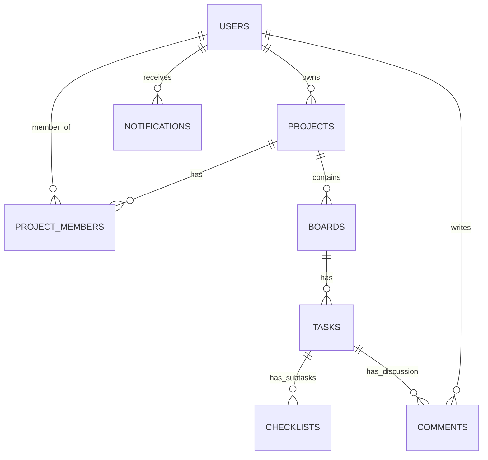
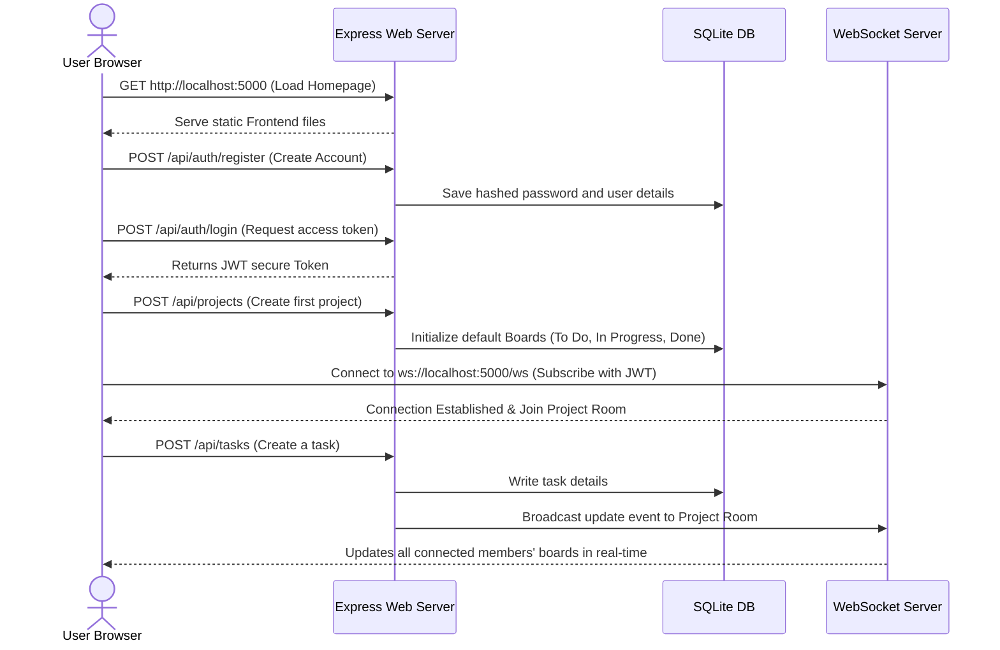

# 🚀 CodeAlpha TaskFlow — Real-Time Project Management Tool

**TaskFlow** is a modern, premium, collaborative project management platform modeled after industry-leading applications like Trello and Asana. It provides a real-time, interactive environment where teams can create projects, manage Kanban boards, track detailed subtask checklists, collaborate via comments, and stay synchronized instantly using WebSocket protocols.

The application features a sleek, dark-mode-first aesthetic with smooth micro-animations, glassmorphism UI elements, and highly responsive interactions.

---

## 🌟 Key Features

*   **🔒 Secure Multi-User Authentication**: JWT (JSON Web Tokens) based auth with encrypted passwords using `bcryptjs` and request validation.
*   **📋 Real-Time Collaborative Kanban Board**: Drag-and-drop-ready task boards where users can create custom stages (columns), reorder columns, and move tasks seamlessly.
*   **🔄 Instant Live Synchronization**: Powered by WebSockets. When a member edits, moves, or creates a task/checklist/column, all active project members see the changes instantly without page reloads.
*   **✅ Advanced Subtask Checklists**: Tasks support individual subtask lists with dynamic progress bars and instant completion toggles.
*   **💬 Collaborative Task Comments**: Team members can discuss tasks in real-time, with an audit log showing when comments are added.
*   **🔔 Live Notifications Center**: Dynamic in-app notifications system that alerts users when they are assigned tasks, added to projects, or when critical updates occur.
*   **🎨 Premium UI/UX Design**: Handcrafted vanilla CSS with modern gradients, responsive design for all device viewports, custom profile avatars, and subtle glassmorphic styling.
*   **💾 Robust SQLite3 Persistence**: Backed by a relational SQLite database operating in **WAL (Write-Ahead Logging)** mode for high-performance concurrent transactions.

---

## 🛠️ Technology Stack

| Layer | Technologies & Tools |
| :--- | :--- |
| **Frontend** | Vanilla HTML5, Vanilla CSS3 (Custom styling, modern CSS custom variables, Flexbox/Grid), Modern ES6+ JavaScript, Native WebSocket Client, Font Awesome Icons, Google Fonts (Outfit, Inter) |
| **Backend** | Node.js, Express.js (REST API server), Express Validator, HTTP server, WS (Node.js WebSocket Server) |
| **Database** | SQLite3 (relational database with `foreign_keys=ON` and `WAL` journal mode enabled) |
| **File Storage** | Multer Middleware (for local image & file attachment uploads) |
| **Security** | JWT (jsonwebtoken), BcryptJS (password hashing) |

---

## 📂 Project Directory Structure

```text
CodeAlpah_TaskFlow/
├── Backend/
│   ├── src/
│   │   ├── controllers/         # Request handling & core business logic
│   │   ├── middleware/          # JWT Auth, file upload & validation middlewares
│   │   ├── routes/              # Express API Route controllers
│   │   ├── database.js          # SQLite Connection & schema initialization
│   │   ├── server.js            # Express server configuration & HTTP server setup
│   │   └── websocket.js         # WebSocket server & real-time message broadcasting
│   ├── uploads/                 # Local directory for user profile avatars & attachments
│   ├── .env                     # Server environment configurations
│   ├── package.json             # NPM package scripts & dependencies
│   └── project_management.db    # Persisted SQLite Database file
├── Frontend/
│   ├── css/                     # Core stylesheet variables, layouts, and components
│   ├── js/                      # Frontend API integrations, Board UI logic & WebSockets
│   ├── index.html               # Welcome landing page
│   ├── auth.html                # Premium Login & Signup slider page
│   ├── dashboard.html           # Project Listing & Member workspace portal
│   └── board.html               # Multi-column Kanban Board & real-time board view
├── .gitignore
└── README.md
```

---

## 🗄️ Database Architecture (SQLite Schema)



The database initializes automatically with the following relational structures:
1.  **`users`**: Stores client login credentials, avatar configurations, and basic profiles.
2.  **`projects`**: Project details created by owners.
3.  **`project_members`**: Pivot table managing joint collaboration (`admin` vs `member` roles).
4.  **`boards`**: Represents the list of Kanban columns (e.g., *To Do*, *In Progress*, *Testing*, *Done*).
5.  **`tasks`**: Work items containing titles, descriptions, priorities (`low`, `medium`, `high`, `urgent`), due dates, and board positions.
6.  **`checklists`**: Individual subtasks with boolean completion states (`is_completed`).
7.  **`comments`**: Real-time task-specific team discussion messages.
8.  **`notifications`**: Real-time notifications for user actions and assignments.

---

## ⚡ Setup & Installation Guide

Follow these exact steps to run CodeAlpha TaskFlow on your local development environment:

### Prerequisites
Make sure you have **Node.js** (v16.0.0 or higher) installed on your system. You can verify this by running:
```bash
node -v
npm -v
```

---

### Step 1: Open the Backend Directory
Launch your terminal and navigate to the project directory, then change directory to `Backend`:
```bash
cd "Backend"
```

### Step 2: Install Server-Side Dependencies
Install all the required production and development dependencies listed in `package.json`:
```bash
npm install
```

### Step 3: Configure Environment Variables
Verify or edit the `.env` file in the root of the `Backend` directory. The application includes a default configuration:
```env
PORT=5000
JWT_SECRET=pm_tool_super_secret_key_2026_xK9mP2qR
JWT_EXPIRES_IN=7d
```

> [!NOTE]
> You can change the `PORT` to any port you like. The frontend is automatically configured to talk to the port you specify here since it is served directly from the express server.

---

### Step 4: Launch the Server
You can start the server in two modes:

#### 1. Development Mode (with Live Reload / Nodemon)
This mode automatically restarts the server whenever backend files are modified.
```bash
npm run dev
```

#### 2. Production Mode (Standard Node Execution)
Run the server normally:
```bash
npm start
```

---

### Step 5: Access the Web Application
Once the terminal outputs that the server is online:
*   **🌐 Frontend Application**: Open [http://localhost:5000](http://localhost:5000) in your web browser.
*   **📋 REST API Endpoint**: [http://localhost:5000/api](http://localhost:5000/api)
*   **🔌 WebSockets connection**: `ws://localhost:5000/ws`

---

## 🔄 End-to-End Application Flow



### 1. Welcome Screen (`index.html`)
*   The entry point of the app. It provides a visual landing page showcasing features and redirects users to register or log in.

### 2. Secure Signup & Login (`auth.html`)
*   Users register with a unique Username, Email, and Password.
*   Upon login, the backend yields a **JWT token** which is stored securely in the browser's `localStorage`.
*   All subsequent API requests automatically pass this JWT token in the `Authorization: Bearer <TOKEN>` header.

### 3. Workspace Dashboard (`dashboard.html`)
*   Lists all projects owned by the user or projects they have been invited to.
*   Users can create new projects, assign visual custom colors to them, and manage members by adding other users using their email addresses.

### 4. Collaborative Kanban Board (`board.html`)
*   **Columns (Boards)**: Dynamic lists representing stages of work. Drag-and-drop enabled.
*   **Task Management**: Users can add tasks, specify high-contrast priority tags, assign due dates, and update descriptions.
*   **Dynamic Checklist**: Checklists let users track sub-items. A progress bar updates in real-time as tasks are checked/unchecked.
*   **Real-time Collaboration**: WebSocket messages automatically sync state across all active browsers:
    *   `BOARD_UPDATE`: Fired on board/column reordering.
    *   `TASK_UPDATE`: Fired when a task is moved, renamed, or customized.
    *   `COMMENT_ADD`: Real-time updates when standard discussions are posted.

---

## 📡 Essential REST API Reference

All requests must contain a valid JWT header unless specified:
`Authorization: Bearer <your_jwt_token>`

### Auth Controller (`/api/auth`)
*   `POST /api/auth/register` - Create new user account (Public).
*   `POST /api/auth/login` - Validate credentials & return JWT (Public).
*   `GET /api/auth/me` - Fetch profile of logged-in user.

### Projects Controller (`/api/projects`)
*   `GET /api/projects` - Retrieve all projects active for the authenticated user.
*   `POST /api/projects` - Create a new project workspace.
*   `POST /api/projects/:id/members` - Invite a user to a project via email.

### Tasks Controller (`/api/tasks`)
*   `POST /api/tasks` - Create a new task within a board column.
*   `PUT /api/tasks/:id` - Update task attributes (title, description, priority, due date).
*   `PUT /api/tasks/:id/move` - Move task position or board column.
*   `DELETE /api/tasks/:id` - Remove task from board.

### Subtasks/Checklists (`/api/tasks/:id/checklist`)
*   `GET /api/tasks/:taskId/checklist` - Get all subtasks.
*   `POST /api/tasks/:taskId/checklist` - Add a subtask checklist item.
*   `PUT /api/tasks/:taskId/checklist/:itemId` - Toggle subtask completion (`is_completed`) or rename.
*   `DELETE /api/tasks/:taskId/checklist/:itemId` - Delete subtask checklist item.

---

> [!TIP]
> **Pro-Tip**: Open two different browser profiles (e.g. Chrome and Edge) or an Incognito window, login with two different registered accounts, open the same project board, and watch tasks move and update instantly across both windows via WebSockets!

Developed with ❤️ as part of the CodeAlpha Internship program.